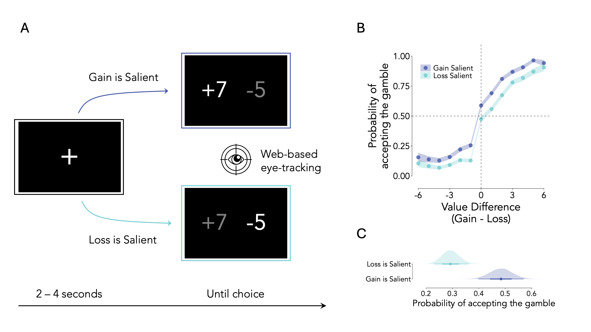
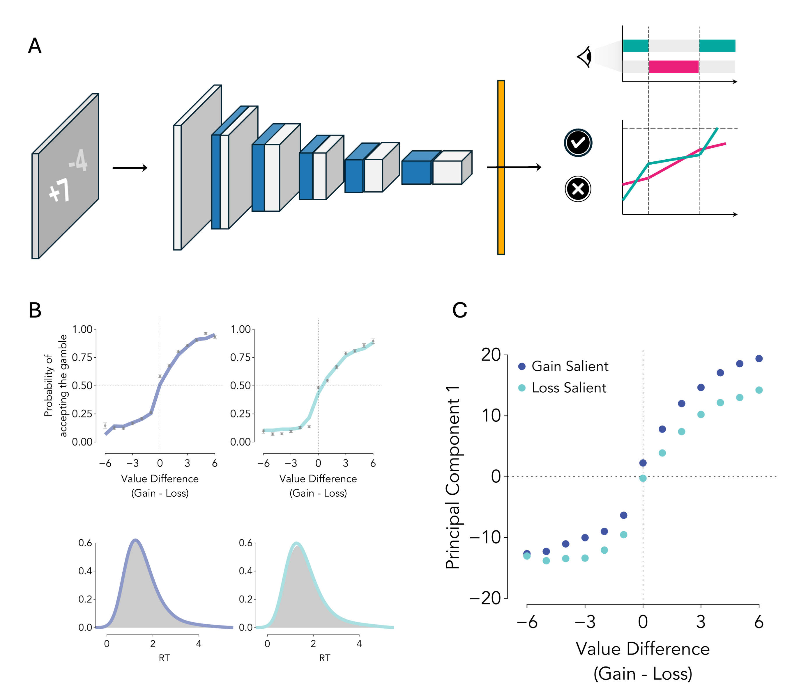

# From Pixels to Preferences: Visual Salience Modulates Value Representations in Economic Choice

A computational modeling approach to understanding how visual salience influences economic decision-making through multiple pathways. This repository contains the implementation of the attentional Visual Accumulator Model (aVAM) and analysis code for investigating salience effects on risky choice behavior.


If you find this code useful, please reference in your paper:
```
@article{dambrogio2024pixels,
  title={From Pixels to Preferences: Visual Salience Modulates Value Representations in Economic Choice},
  author={D'Ambrogio, Simone and Platt, Michael and Sheng, Feng},
  journal={arXiv preprint},
  year={2024}
}
```

 **Data**

The data repository contains:
- **Model fits and results**: Pre-computed model outputs to replicate all figures
- **Preprocessed behavioral data**: Ready-to-use data for replicating statistical analyses
- **VAM training inputs**: Processed visual stimuli and behavioral data for training the aVAM model


## Summary

Our approach combines eye-tracking experiments with computational modeling to investigate how visual salience affects economic choice through two distinct pathways:

1. **Indirect pathway**: Salience influences gaze allocation, which then affects choice through attentional amplification
2. **Direct pathway**: Salience directly modulates internal value representations before attention takes effect



The attentional Visual Accumulator Model (aVAM) simulates the entire decision process from raw pixel input to choice output, using a Convolutional Neural Network (CNN) for visual processing and a gaze-modulated Linear Ballistic Accumulator (LBA) for evidence accumulation.



# Instructions

The code has been tested on macOS and Linux and requires Python 3.8+ and R 4.0+.

## Environment Setup

### Python Dependencies (aVAM Training)

For training the attentional Visual Accumulator Model, we build upon the original VAM implementation. Please follow the setup instructions from the original VAM repository:

**[VAM Repository Setup Instructions](https://github.com/pauljaffe/vam/tree/main)**

### R Dependencies
```r
# Install required R packages
install.packages(c("tidyverse", "brms", "ggdist", "yaml", "mediation"))
```

## Data Preparation

Download the data from the [OSF repository](https://osf.io/uk46v/) and organize it in a `data/` folder as shown in the Repository Structure section below.

1. **Behavioral Data**: Use the preprocessed behavioral data from the repository (`data_behavior.csv`)
2. **Model Results**: Pre-computed model fits and outputs are available for immediate figure replication
3. **VAM Training Data**: Processed visual stimuli and behavioral data ready for aVAM training
4. **Eye-tracking Data**: Preprocessed gaze data from webcam-based eye tracking is included

## Training the aVAM

The attentional Visual Accumulator Model (aVAM) extends the original VAM framework. For detailed training instructions, please refer to the **[original VAM repository](https://github.com/pauljaffe/vam)**.

```bash
# Train the attentional Visual Accumulator Model
python scripts/vam/train.py \
    --data_dir data/processed/vam \
    --save_dir results/vam \
    --expt_name brightness_experiment
```

**Prerequisites**: 
- Follow the Python environment setup from the [VAM repository](https://github.com/pauljaffe/vam)
- Ensure CUDA-compatible GPU with appropriate drivers for training
- Use Python 3.10 (strongly recommended based on VAM requirements)

## Analysis Pipeline

### 1. Behavioral Analysis
```r
# Run mediation analysis
Rscript scripts/mediation/fit.R
Rscript scripts/mediation/make-figures.R
```

### 2. Computational Modeling
```bash
# Extract network weights and activations
python scripts/vam/save_network_weights.py \
    training_outputs/brightness_experiment \
    --data_dir data/processed/vam \
    --output_dir results/vam/weights \
    --checkpoint 69 \
    --n_total_images 35000

# Analyze internal representations
julia scripts/vam/analyze_network_weights.jl

# Generate model predictions
julia scripts/vam/predict_choices_rts.jl
```

### 3. Generate Figures
```r
# Generate all manuscript figures
Rscript scripts/p\(accept\)/make-figures.R
Rscript scripts/p\(gaze\)/make-figures.R
Rscript scripts/gaze-over-time/make-figures.R
```

## Configuration

All configuration options are specified in `config.yaml`:

```yaml
local:
  data: "data/"
  
colors:
  gain-salient: "#1f77b4"
  loss-salient: "#2ca02c"
  
vam:
  data_dir: "data/processed/vam"
  save_dir: "results/vam"
  expt_name: "brightness_experiment"
```

## Repository Structure

```
├── data/                   # Data files (download from OSF)
│   ├── processed/         # Processed behavioral and modeling data
│   │   ├── data_behavior.csv    # Main behavioral dataset
│   │   └── vam/                 # VAM training inputs
│   └── results/           # Analysis outputs and model fits
├── docs/                  # Documentation and manuscript
│   └── manuscript/        # LaTeX manuscript files
├── figures/               # Generated figures (created by scripts)
├── scripts/               # Analysis scripts
│   ├── mediation/        # Mediation analysis
│   ├── vam/              # VAM modeling
│   └── p(accept)/        # Choice probability analysis
├── src/                   # Source code
│   ├── vam/              # VAM implementation
│   └── utils.R           # R utilities
└── config.yaml           # Configuration file
```

**Note**: The `data/` folder structure is expected by all analysis scripts. Download the data from OSF and organize it as shown above.

# Tips

- All analysis parameters can be configured in `config.yaml`
- The `debug` configuration reduces computational requirements for testing
- Model checkpoints are saved automatically during training
- Use `--checkpoint` flag to resume training from a specific checkpoint
- Eye-tracking data requires webcam calibration for best results
- Multiple salience conditions can be analyzed simultaneously using the config system

# Reproducibility

To reproduce the main results:

## Quick Reproduction (using pre-computed results)

1. **Download Data**: Get the data from the OSF repository and organize it in the `data/` folder as shown in the Repository Structure

2. **Generate Figures**: Use the pre-computed model fits to immediately reproduce all figures:
   ```bash
   Rscript scripts/mediation/make-figures.R
   Rscript scripts/p\(accept\)/make-figures.R
   # Run other figure generation scripts
   ```

## Full Reproduction (from scratch)

1. **Behavioral Analysis**:
   ```bash
   Rscript scripts/mediation/fit.R
   ```

2. **Computational Modeling**:
   ```bash
   python scripts/vam/train.py --data_dir data/processed/vam
   ```

3. **Generate All Figures**:
   ```bash
   make figures  # Or run individual figure scripts
   ```

# Troubleshooting

- **CUDA Errors**: Try reducing batch size if you encounter GPU memory issues
- **JAX Installation**: Follow the specific JAX installation instructions for your CUDA version from the [VAM repository](https://github.com/pauljaffe/vam)
- **Python Environment**: Use Python 3.10 as recommended by the original VAM implementation
- **R Package Issues**: Ensure all R dependencies are installed with correct versions
- **Model Loading**: Check that checkpoint files match the model configuration
- **Eye-tracking Data**: Verify webcam calibration quality before analysis
- **Missing Data**: Download the complete dataset from the OSF repository and ensure it's organized in the `data/` folder structure
- **VAM-specific Issues**: Refer to the [original VAM repository](https://github.com/pauljaffe/vam) for additional troubleshooting

# Citation

If you use this code or build upon this work, please cite:

```bibtex
@article{dambrogio2024pixels,
  title={From Pixels to Preferences: Visual Salience Modulates Value Representations in Economic Choice},
  author={D'Ambrogio, Simone and Platt, Michael and Sheng, Feng},
  journal={arXiv preprint},
  year={2024}
}
```

If you use the Visual Accumulator Model (VAM) framework, please also cite the original VAM paper:

```bibtex
@article{jaffe2024vam,
  title={An image-computable model of speeded decision-making},
  author={Jaffe, Paul I. and Gustavo, X. S. R. and Schafer, Robert J. and Bissett, Patrick G. and Poldrack, Russell A.},
  journal={eLife},
  volume={13},
  pages={RP98351},
  year={2024}
}
```

# Disclaimer

This repository contains research code for investigating visual salience effects on economic choice. The implementation includes novel extensions to the Visual Accumulator Model framework and Bayesian mediation analysis techniques. The code has been tested to reproduce the reported results across multiple experimental conditions.

# Contact

For questions about the code or methodology, please open an issue or contact the corresponding authors.
